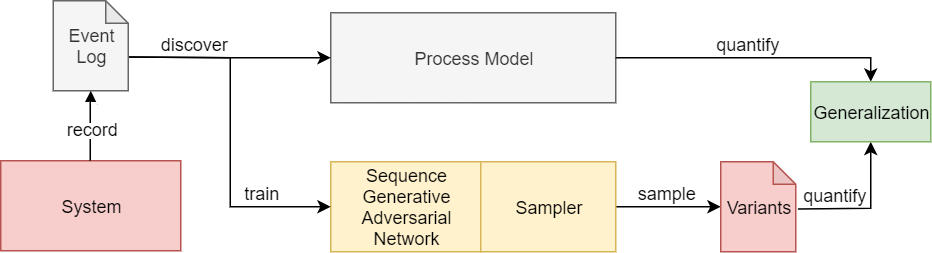
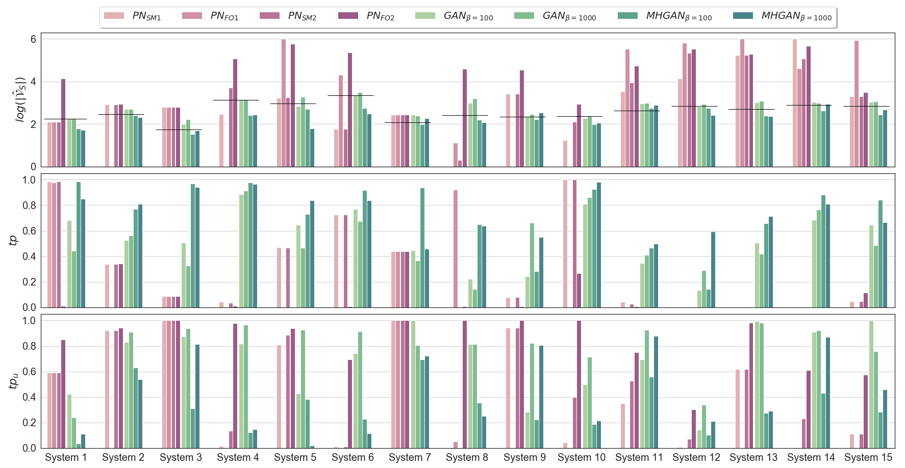
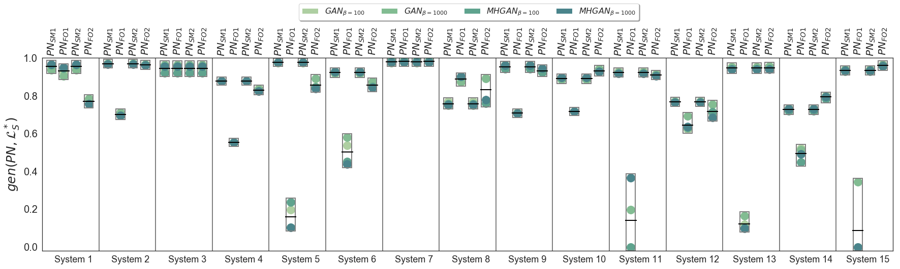

# AVATAR
This project is the implementation of the *AdVersarial system vArianT AppRoximation* (AVATAR) approach described in the paper [Adversarial System Variant Approximation to Quantify Process Model Generalization](https://ieeexplore.ieee.org/document/9237923) by [Julian Theis](http://julian-theis.github.io) and [Houshang Darabi](https://scholar.google.com/citations?user=PVzYdvoAAAAJ). Both authors are with the [Process Mining and Intelligent System Analytics Team (PROMINENT)](https://prominent.uic.edu/) at the University of Illinois at Chicago, USA. 

```
@article{theis2020adversarial,
  title={Adversarial System Variant Approximation to Quantify Process Model Generalization}, 
  author={J. {Theis} and H. {Darabi}},
  journal={IEEE Access}, 
  year={2020},
  volume={8},
  number={},
  pages={194410-194427},
  doi={10.1109/ACCESS.2020.3033450}}
}
```

# Overview
AVATAR is a methodology to measure the generalization of process models by following the subsequent approach:
<center>
  </img>
 </center>

A Sequence Generative Adversarial Network is used to obtain a neural network that approximates the behavior of a system under investigation. This neural network is trained on observed behavior from recorded event logs only. The generalization quality is assessed by comparing the unobserved behavior modeled by the process model with the unobserved behavior modeled by the neural network. The Metropolis-Hastings algorithm can be used to further increase the sampling quality from the Sequence Generative Adversarial Network.

The results of a controlled experiment show that Sequence Generative Adversarial Networks sample unknown variants of the system better than current process discovery algorithms.
<center>
  </img>
</center>

Consequently, the generalization of a process model can be calculated as the harmonic mean of its fitness and precision with respect to an event log that contains the variants that were sampled from the Sequence Generative Adversarial Network.
This leads conclusively to a closer expected generalization score when assessing the extent to which a process model describes the actual holistic system behavior.
<center>
  </img>
 </center>

# How To
## Install
AVATAR has been developed using Python 3.6. The required Python libraries are available in the [requirements-cpu.txt](requirements-cpu.txt) and [requirements-gpu.txt](requirements-gpu.txt) file, depending if you plan on using a CPU or GPU environment.
Please run the [install/install_script.py](install/install_script.py) after creating your Python environment.

## Systems
### System Variant Playout
To playout a unique system variant log from e.g. *PA System 11 3*, simply run the following command from the base directory. The script will create the variant log of the system, a train variant log, and a test variant log as txt files. Moreover, the train variants are used to create a CSV and an XES based event log suitable for process discovery.
The script also print the number of unique events, number of train, test, and system variants, and the maximum system variant length.
```python
python -m systems.playout.pa_system_11_3
```

All available system scripts can be found in [systems/playout](systems/playout).

<a name="Processes"></a>
## Processes
<a name="Process Variant Playout"></a>
### Process Variant Playout
This script plays out variants from a given Petri net. --traces refers to the number of variants to be generated. Default value is one million. The variants will be stored in *data/variants/*.
As soon as the variants are generated, the script evaluates the obtained ones against the ground truth system. If one wants to evaluate only, without playing out variants, set --eval_only to True.

```python
python -m processes.playout --system <...> --pn <....pnml> --eval_only <True/False> --traces 1000000
```

### Process Conformance Checking
Checking the conformance and obtaining the two best Petri net models per system and process discovery algorithm, as explained in the paper (Section V.C.).
The system parameter describes the underlying system, miner describes the process discovery algorithm used. The Petri nets must be stored as PNML files located in the folder *data/pns/\<system\>*.
```python
python -m processes.conformancechecker --system <...> --miner <splitminer/fodina>
```

### Process Evaluation
The subsequent script evaluates the variants sampled from a Petri net against the ground truth system variants when --eval_only is set to *True*.

```python
python -m processes.playout --system <...> --pn <....pnml> --eval_only True
```

## AVATAR
### SGAN Training
SGAN training is performed in the following way. This will automatically sample from all trained models, evaluate them, and show the ten best performing ones based on the test data. The results are stored with the model as json.
```python
python -m avatar.training --system <...> --job <0/1> --gpu <...>
```

### SGAN Sampling
Naive sampling is performed in the following way:
```python
python -m avatar.sampling --system <...> --job <0/1> --gpu <...> --suffix <...> --strategy naive --n_samples <...>
```

Sampling using the Metropolis-Hastings algorithm is performed in the following way.
```python
python -m avatar.sampling --system <...> --job <0/1> --gpu <...> --suffix <...> --strategy mh --mh_count <...> --mh_patience <...> --mh_k <...> --mh_maxiter <...>
```

### SGAN Evaluation
Evaluate the sampling. 

```python
python -m avatar.evaluation --system <...> --job <0/1> --gpu <...> --suffix <...> --strategy <naive/mh>
```

### Generalization
Calculate the AVATAR generalization as follows.

```python
python -m avatar.generalization --system <...> --job <0/1> --suffix <...> --strategy <naive/mh> --pn <...>
```
